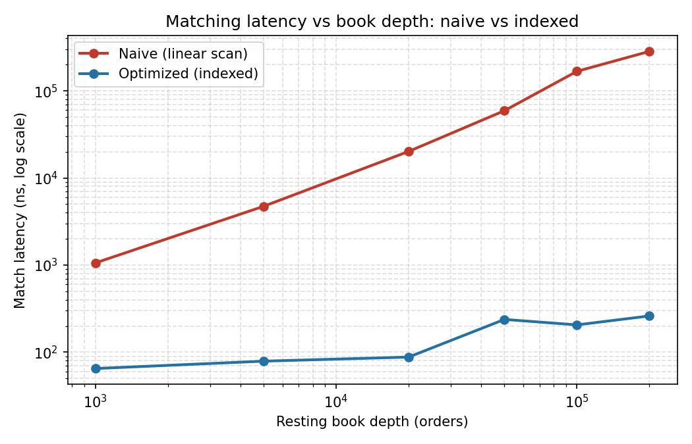

# lob-engine: Price-Time Priority Limit Order Book

A limit order book and matching engine in C++17, built to benchmark matching
latency at the microsecond/nanosecond level rather than to trade real capital.
Phase 1 of a project extending toward replay of real NSE tick data and a
simple strategy running against it.

## Why this exists

Most of my other work (ARMCE, NSE Calendar Anomaly Scanner) is offline
statistical research in Python, regime detection, volatility modeling,
hypothesis testing. This project is deliberately the opposite: a
single-purpose, low-latency C++ core with no external dependencies, built to
demonstrate the execution-engineering side that pure research projects don't.

## What it does

- Price-time priority matching: best bid = highest price, best ask = lowest
  price, FIFO within a price level.
- Prices stored as `int64_t` ticks, never `double`, avoids float-equality
  bugs in a matching engine.
- O(1) order cancellation via an id -> location index, instead of scanning
  the book.
- A benchmark harness that fires random order flow at the book and reports
  matching latency percentiles.

## Build & run

```bash
make run
```

No external dependencies, just a C++17 compiler. Runs a correctness demo
(a few orders, trades printed so you can eyeball the matching logic), then
a 1,000,000-order latency benchmark.

## Latest benchmark (single thread, -O2, this container)

```
mean:   192 ns
p50:    137 ns
p99:    529 ns
p99.9:  1896 ns
throughput: ~5.2M orders/sec (single thread)
```

**Honest caveat:** the `max` latency in a raw run can spike into the
milliseconds (observed once, ~11ms), that's OS scheduling jitter (page
faults, context switches), not the matching engine itself being slow. A
production latency benchmark would pin the process to a core and exclude
warmup, GC-equivalent, and OS-noise outliers before reporting a "real" tail
number. p99/p99.9 are reported here specifically because they're far more
robust to that noise than `max` is, reporting `max` from an unpinned,
un-isolated benchmark without that caveat would be a **red flag** in an
interview, so it's better you know that now than have an interviewer catch
it.

## The actual finding: why the indexing matters

It's easy to claim an order book is "fast" without proving the design choice
mattered. So `scaling_bench` builds a second, deliberately naive
implementation (`NaiveOrderBook`: unsorted `std::vector`, linear scan for
best price) with identical matching semantics, cross-checks it against the
real one on a fixed order sequence to confirm both produce the same trades,
then times single-match latency at increasing resting book depth:

```
depth       optimized (ns)    naive (ns)        speedup
1000        65                1059              16.2x
5000        79                4730              59.6x
20000       88                20164             229.6x
50000       238               59188             248.9x
100000      206               167579            814.2x
200000      261               283787            1086.6x
```

The optimized book (price-sorted `std::map` + FIFO `std::deque`) stays close
to flat because finding the best price is an O(1) lookup (`begin()`).
The naive book scans every resting order to find the best price, so its
latency grows roughly linearly with book depth, at 200,000 resting orders
it's over 1,000x slower for the exact same trade. This is the concrete
argument for the design, not just an assertion that it's "optimized."



Run it yourself: `make run-scaling`

## Phase 2: replaying a real trading day

`market_replay` feeds the book order flow derived from **real NSE Nifty 50
15-second OHLC data** (from the trading day of 17 September 2026), instead
of uniform random noise.

**Be precise about what this is and isn't:** genuine order-by-order L2
depth data isn't publicly available to a student without a paid vendor feed
or exchange membership, that's a real constraint, not something to paper
over. What's real here is the 15-second price *path* itself. For each bar,
the program submits orders that walk through that bar's actual
Open → Low/High → High/Low → Close range (direction chosen by whether the
bar closed up or down), so every trade price in the simulation is anchored
to a real, timestamped NSE price, not invented. This is a named technique
(OHLC-to-order-flow reconstruction) for working backward from bar data when
tick data isn't available, and the README says so explicitly rather than
letting the "real data" framing overclaim.

**The finding, real volatility clustering, measured, not assumed:**

```
window                      bars    avg range (pts)     avg latency/order (ns)
Opening (09:15-09:30)       60      8.39                164
Midday calm (12:00-12:15)   60      4.67                149
Closing (15:15-15:30)       60      0.40                104
```

The average 15-second price range was ~1.8x higher in the opening 15
minutes than midday, and ~21x higher than the closing 15 minutes measured
on this specific day, a real instance of the well-known opening-volatility
stylized fact, checked against actual data rather than cited from a
textbook. Matching latency also runs slightly higher during the busier,
more volatile open, though at these absolute latencies (~100-165ns) the
effect is modest, and that's the honest reading of the number rather than
overselling it.

Run it yourself: `make run-replay`

## Roadmap

- [x] Phase 1: correct, benchmarked price-time priority matching engine
- [x] Phase 1.5: naive-vs-optimized scaling comparison (the actual
      quantified performance claim)
- [x] Phase 2: replay real NSE Nifty 50 price action through the book
- [ ] Phase 3 (stretch, not required for correctness): a simple
      market-making strategy reading the live book, with its own
      decision-latency measured separately from matching latency
- [ ] Phase 4 (stretch): CPU-pinned benchmark harness for a defensible
      tail-latency number under production conditions

## What I'd change with more time

- Custom flat-array price levels instead of `std::map` for the top-of-book
  region, to cut cache misses further
- Lock-free single-producer/single-consumer queue if this becomes
  multi-threaded